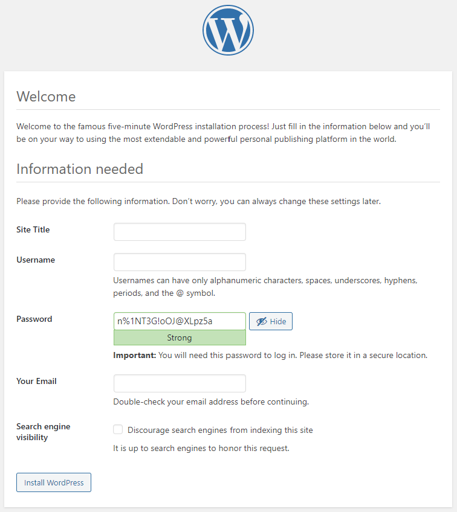

### Use Terraform to Create a Wordpress site with separate web, db, and storage servers

**Install Terraform:**
```
https://www.terraform.io/downloads.html
```

**Create a directory on your local machine for the Terraform files:**
```
mkdir ~/wordpress_lab
cd ~/wordpress_lab
```

**Create the file `main.tf`:**
```
vim ~/wordpress_lab/main.tf
```

**With the following contents:**
```
# Configure the OpenStack Provider
provider "openstack" {
  user_name   = "<YOUR_OS_USERNAME>"
  tenant_name = "<YOUR_OS_PROJECT>"
  password    = "<YOUR_OS_PASSWORD>"
  auth_url    = "<YOUR_OS_AUTH_URL>"
  region      = "<YOUR_OS_REGION>"
}


###################################################
# wp-web                                          #
###################################################
# Create the wp-web web server
resource "openstack_compute_instance_v2" "wp-web" {
  name            = "wp-web"
  image_name      = "CentOS 8"
  flavor_name     = "medium"
  key_pair        = "surface" # Replace this with the name of your SSH key
  security_groups = ["SSH", "web"]

  network {
    name = "INTERNAL_NET"
  }

  # Send the wp-web1.tpl script through user_data
  user_data = "${data.template_file.wp-web1.rendered}"
}

# Create the data object for the wp-web1 user_data script
data "template_file" "wp-web1" {
  template = "${file("templates/wp-web1.tpl")}"

  vars = {
    wp-storage_private_ip = "${openstack_compute_instance_v2.wp-storage.network.0.fixed_ip_v4}"
    wp-db_private_ip = "${openstack_compute_instance_v2.wp-db.network.0.fixed_ip_v4}"
  }
}

# Attach a floating IP of 10.0.0.241 to the the wp-web web server
resource "openstack_compute_floatingip_associate_v2" "wp-web-ip" {
  floating_ip = "10.0.0.241" # Pick a valid Floating IP for your environment
  instance_id = "${openstack_compute_instance_v2.wp-web.id}"
  fixed_ip    = "${openstack_compute_instance_v2.wp-web.network.0.fixed_ip_v4}"
}
###################################################


###################################################
# wp-db                                           #
###################################################
# Create the wp-db database server
resource "openstack_compute_instance_v2" "wp-db" {
  name            = "wp-db"
  image_name      = "CentOS 8"
  flavor_name     = "medium"
  key_pair        = "surface" # Replace this with the name of your SSH key
  security_groups = ["SSH", "mysql"]

  network {
    name = "INTERNAL_NET"
  }

  # Send the wp-db.tpl script through user_data
  user_data = "${data.template_file.wp-db.rendered}"
}

# Create the data object for the wp-db user_data script
data "template_file" "wp-db" {
    template = "${file("templates/wp-db.tpl")}"
}

# Attach a floating IP of 10.0.0.242 to the the wp-db database server
resource "openstack_compute_floatingip_associate_v2" "wp-db-ip" {
  floating_ip = "10.0.0.242" # Pick a valid Floating IP for your environment
  instance_id = "${openstack_compute_instance_v2.wp-db.id}"
  fixed_ip    = "${openstack_compute_instance_v2.wp-db.network.0.fixed_ip_v4}"
}
###################################################


###################################################
# wp-storage                                      #
###################################################
# Create the wp-storage NFS server
resource "openstack_compute_instance_v2" "wp-storage" {
  name            = "wp-storage"
  image_name      = "CentOS 8"
  flavor_name     = "medium"
  key_pair        = "surface" # Replace this with the name of your SSH key
  security_groups = ["SSH", "nfs"]

  network {
    name = "INTERNAL_NET"
  }

  # Send the wp-storage.tpl script through user_data
  user_data = "${data.template_file.wp-storage.rendered}"
}

# Create the data object for the wp-storage user_data script
data "template_file" "wp-storage" {
    template = "${file("templates/wp-storage.tpl")}"
}

# Attach a floating IP of 10.0.0.230 to the the wp-storage NFS server
resource "openstack_compute_floatingip_associate_v2" "wp-storage-ip" {
  floating_ip = "10.0.0.230" # Pick a valid Floating IP for your environment
  instance_id = "${openstack_compute_instance_v2.wp-storage.id}"
  fixed_ip    = "${openstack_compute_instance_v2.wp-storage.network.0.fixed_ip_v4}"
}
###################################################
```
Make sure to replace the authentication info at the top along with the SSH key name and the floating IPs
Replace these items with info from your cloud

**Create the templates directory:**
```
mkdir ~/wordpress_lab/templates
```

**Create the wp-db user_init script:**
```
vim ~/wordpress_lab/templates/wp-db.tpl
```
**With the following contents:**
```
#!/bin/bash
dnf install -y mariadb-server vim bash-completion
setenforce 0
sed -i 's/SELINUX=enforcing/SELINUX=permissive/' /etc/selinux/config
systemctl enable mariadb
systemctl start mariadb
echo "[client]" > ~/.my.cnf
echo "user=root" >> ~/.my.cnf
echo "password=" >> ~/.my.cnf
mysql -e "CREATE DATABASE wordpress"
mysql -e "CREATE USER 'wordpress_user'@'%' IDENTIFIED BY 'password12345'"
mysql -e "GRANT ALL ON wordpress.* TO 'wordpress_user'@'%'"
mysql -e "FLUSH PRIVILEGES"
```

**Create the wp-storage user_init script:**
```
vim ~/wordpress_lab/templates/wp-storage.tpl
```
**With the following contents:**
```
#!/bin/bash
dnf install -y dnf nfs-utils vim bash-completion
systemctl enable nfs-server
mkdir -p /var/www/html/
echo "/var/www/html 192.168.0.0/24(rw,sync,no_root_squash)" >> /etc/exports
setenforce 0
sed -i 's/SELINUX=enforcing/SELINUX=permissive/' /etc/selinux/config
systemctl start nfs-server
systemctl enable nfs-server
```

**Create the wp-web1 user_init script:**
```
vim ~/wordpress_lab/templates/wp-web1.tpl
```
**With the following contents:**
```
#!/bin/bash
STORAGE_PRIVATE=${wp-storage_private_ip}
DB_PRIVATE=${wp-db_private_ip}

dnf install -y httpd mariadb-common php-fpm php-mysqlnd wget php-json tar bash-completion vim nfs-utils nfs4-acl-tools
systemctl enable httpd && systemctl start httpd

setenforce 0
sed -i 's/SELINUX=enforcing/SELINUX=permissive/' /etc/selinux/config

echo "$STORAGE_PRIVATE:/var/www/html /var/www/html nfs defaults 0 0" >> /etc/fstab

# while loop to see if NFS mount exists
# only extract the wordpress files if the NFS share is mounted
while true; do
    mount | grep html
    if [ $? -eq 0 ]; then
        echo "Run the rest of the script"
        wget https://www.wordpress.org/latest.tar.gz
        tar -xzvf latest.tar.gz
        cp -R wordpress/* /var/www/html/
        cp /var/www/html/wp-config-sample.php /var/www/html/wp-config.php
        sed -i 's/database_name_here/wordpress/' /var/www/html/wp-config.php
        sed -i 's/username_here/wordpress_user/' /var/www/html/wp-config.php
        sed -i 's/password_here/password12345/' /var/www/html/wp-config.php
        sed -i "s/localhost/$DB_PRIVATE/" /var/www/html/wp-config.php
        exit
    else
        echo "The NFS mount doesn't exist, trying to mount again"
        sleep 5
        timeout 5 mount -a
    fi
done
```

**Initialize the Terraform working directory:**
```
terraform init
```

**Note: If you get the error `Error: Failed to install providers` and it suggests:**
```
If these suggestions look correct, upgrade your configuration with the
following command:
    terraform 0.13upgrade .
```

**Then go ahead and run:**
```
terraform 0.13upgrade .

# Don't forget to rerun the init after the upgrade
terraform init
```

**Apply the Terraform configuration:**
```
terraform apply
```

It might take some time for all the user_data scripts to finish depending on the speed of your hardware. Eventually you will be able to hit the Floating IP of your `wp-web1` instance in your web browser and see the Wordpress welcome screen.




[<-- Back to LABs](../README.md)  
[<-- Back to Main](../../README.md)
